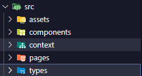

# **USER LOGIN**

## **Sobre** 📝
Essa aplicação foi desenvolvida como uma tarefa prática para consumir uma API criada por mim. O objetivo principal é aprimorar meus conhecimentos em **React**, **Tailwind**, **TypeScript**, e o uso de **Fetch** para realizar requisições HTTP.

## **Objetivo** 🎯
Criar uma aplicação funcional que implemente um **CRUD** (Create, Read, Update, Delete) de usuários, proporcionando uma interface intuitiva e eficiente.

## **Tecnologias Utilizadas** 🛠️
- **React**: Framework para construção de interfaces de usuário.
- **Tailwind CSS**: Biblioteca para estilização com classes utilitárias.
- **TypeScript**: Superset do JavaScript com tipagem estática.

## **Estrutura do Projeto** 📂
Abaixo está uma captura de tela representando a organização dos diretórios e arquivos:  

